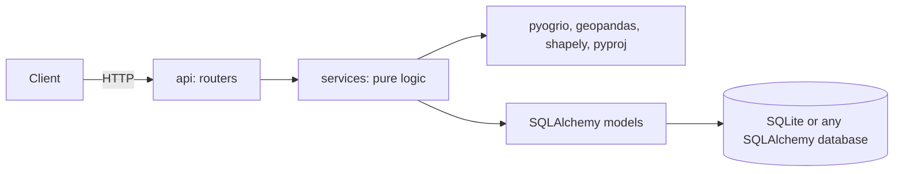
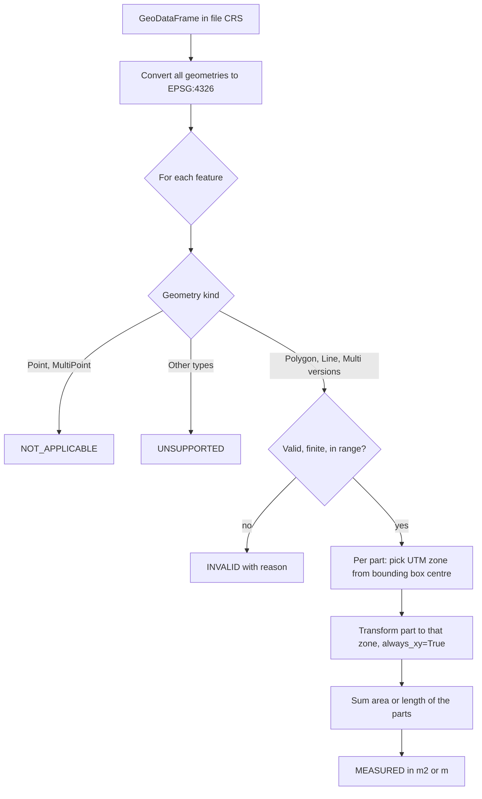

# Geospatial File Measurement API

A small backend service (FastAPI) that accepts a **zipped Shapefile** or a **KML** file, extracts every feature, and returns **areas of polygons and lengths of lines in square meters and meters**.

The point of the project is correctness: files usually arrive in latitude and longitude (degrees), and area or distance must never be computed on degrees. Every measurement here is made after transforming the geometry into a projected metric CRS (the right UTM zone for that feature).

- Upload `.kml` or `.zip` (containing one Shapefile) and get a file id back.
- Read file information and per feature measurements with pagination.
- Points, collections, empty and invalid geometries are reported per feature, never fatal.
- Unsafe or broken uploads are rejected with clear, stable error codes.
- 146 tests, about 98 percent line coverage.

## Contents

1. [Setup](#setup)
2. [Run](#run)
3. [Run the tests](#run-the-tests)
4. [Quick try with the samples](#quick-try-with-the-samples)
5. [API](#api)
6. [Architecture](#architecture)
7. [Design decisions](#design-decisions)
8. [Accuracy and performance](#accuracy-and-performance)
9. [Known limitations](#known-limitations)
10. [Configuration](#configuration)
11. [Project layout](#project-layout)
12. [Learnings](#learnings)
13. [Future scope](#future-scope)

## Setup

Requirements: **Python 3.11 or newer** (developed on 3.13). Everything installs from pip wheels, so you do **not** need to install GDAL or PROJ yourself.

Windows (PowerShell):

```powershell
python -m venv .venv
.venv\Scripts\Activate.ps1
pip install -r requirements.txt
```

macOS or Linux:

```bash
python3 -m venv .venv
source .venv/bin/activate
pip install -r requirements.txt
```

If PowerShell blocks the activate script, run `Set-ExecutionPolicy -Scope Process Bypass` once in that window.

## Run

```bash
uvicorn app.main:app --reload
```

- API: http://localhost:8000
- Interactive docs (Swagger UI): http://localhost:8000/docs
- The SQLite database is created automatically at `data/app.db`.

## Run the tests

```bash
pip install -r requirements-dev.txt
pytest -q
```

With coverage: `pytest --cov=app --cov-report=term-missing`. Lint: `ruff check .`

## Quick try with the samples

Two sample files are in [`samples/`](samples) (made up plots near Bengaluru). They can be regenerated with `python scripts/make_samples.py`.

On Windows PowerShell use `curl.exe` (plain `curl` is an alias for something else). On macOS or Linux use `curl`. Keep the **trailing slash** in the URLs.

```powershell
curl.exe -F "file=@samples/survey.kml" http://localhost:8000/api/files/
```

Copy the `id` from the response and use it below:

```powershell
curl.exe http://localhost:8000/api/files/<id>/
curl.exe "http://localhost:8000/api/files/<id>/measurements/"
curl.exe "http://localhost:8000/api/files/<id>/measurements/?limit=2&offset=1&include_geometry=true"
```

Upload the zipped Shapefile the same way: `curl.exe -F "file=@samples/parcels.zip" http://localhost:8000/api/files/`.

Measurements of `samples/survey.kml` as returned by the service:

| index | name | type | result |
|---|---|---|---|
| 0 | Plot A | Polygon | `area_m2` 1,201,683.9 (about 120 hectares) in `EPSG:32643` |
| 1 | Plot B (with a pond) | Polygon | `area_m2` 1,009,445.1 (the pond is excluded) |
| 2 | Access road | LineString | `length_m` 2,958.6 |
| 3 | Main gate | Point | `NOT_APPLICABLE`, no measurement |

## API

All paths keep the trailing slash. Errors always use the same envelope (see [Errors](#errors)).

### `POST /api/files/`

Upload and process a file. Body is `multipart/form-data` with one part named `file`. Accepted: `.kml`, and `.zip` containing exactly one Shapefile (`.shp`, `.shx`, `.dbf` and `.prj`, in the zip root or any folder).

Processing is synchronous: when the response arrives the file is already `COMPLETED` (or the request failed).

Response `201`:

```json
{
  "id": "bf6786232b8e41e3a449c7a96873901f",
  "filename": "survey.kml",
  "file_type": "KML",
  "status": "COMPLETED",
  "crs": "EPSG:4326",
  "feature_count": 4,
  "error_message": null,
  "created_at": "2026-10-07T14:55:55.585532Z"
}
```

### `GET /api/files/{id}/`

File information. Same body as above. A file whose content could not be processed has `status: FAILED`, `feature_count: 0` and an `error_message`.

### `GET /api/files/{id}/measurements/`

Per feature results, ordered by `index`.

| Query parameter | Default | Meaning |
|---|---|---|
| `limit` | 100 | Page size, 1 to 1000 |
| `offset` | 0 | Features to skip |
| `include_geometry` | false | Also return each feature's `geometry` (GeoJSON, in the file's own CRS) |

Response `200`:

```json
{
  "file_id": "bf6786232b8e41e3a449c7a96873901f",
  "total": 4,
  "limit": 100,
  "offset": 0,
  "features": [
    {
      "index": 0,
      "geometry_type": "Polygon",
      "crs": "EPSG:4326",
      "properties": { "Name": "Plot A", "owner": "Ravi" },
      "measurement": {
        "status": "MEASURED",
        "area_m2": 1201683.9190971013,
        "length_m": null,
        "measurement_crs": "EPSG:32643",
        "message": null
      }
    },
    {
      "index": 3,
      "geometry_type": "Point",
      "crs": "EPSG:4326",
      "properties": { "Name": "Main gate", "owner": null },
      "measurement": {
        "status": "NOT_APPLICABLE",
        "area_m2": null,
        "length_m": null,
        "measurement_crs": null,
        "message": "Points have no measurement."
      }
    }
  ]
}
```

`measurement.status` values:

| Status | Meaning |
|---|---|
| `MEASURED` | Area (polygons) or length (lines) was computed. `measurement_crs` is the UTM zone used, or a comma separated list if the parts of a multi-part geometry fall in different zones |
| `NOT_APPLICABLE` | Point or MultiPoint. Nothing to measure |
| `UNSUPPORTED` | Geometry type not measured (for example GeometryCollection) or location outside UTM coverage (latitude below -80 or above 84) |
| `INVALID` | Geometry is missing, empty, self-intersecting, has out of range coordinates, or measuring it failed. `message` says why |

### `GET /health`

Returns `{"status": "ok"}`.

### Errors

```json
{
  "error": {
    "code": "UNPROCESSABLE_FILE",
    "message": "Shapefile has no .prj file, so its coordinate reference system is unknown.",
    "file_id": "3f2b8c1e9a7d4c5e8b6a1d2c3e4f5a6b"
  }
}
```

| HTTP | `code` | When |
|---|---|---|
| 400 | `INVALID_REQUEST` | No `file` part, empty file, bad query parameter |
| 404 | `FILE_NOT_FOUND` | Unknown file id |
| 409 | `FILE_NOT_COMPLETED` | Measurements requested for a file that is `PROCESSING` or `FAILED` |
| 413 | `FILE_TOO_LARGE` | Upload bigger than `MAX_UPLOAD_MB` |
| 415 | `UNSUPPORTED_FILE_TYPE` | Not `.kml` or `.zip`, or the content does not match the extension (KMZ is not supported: unzip it and upload the `.kml`) |
| 422 | `UNPROCESSABLE_FILE` | Content cannot be processed: unsafe zip, no `.shp`, several `.shp`, missing `.prj`, corrupt or empty dataset, too many features |
| 500 | `INTERNAL_ERROR` | Unexpected error. Generic message, details only in the server log |

Rule: problems found while **saving** the upload (400, 413, 415) create no record. Problems found while **reading the content** (422) create a `FAILED` record and the response carries its `file_id`, so `GET /api/files/{id}/` explains what happened.

## Architecture

### Structure



- `app/api` only translates HTTP to function calls.
- `app/services` holds all logic and knows nothing about FastAPI. Services raise `AppError` subclasses; one handler turns them into the JSON error envelope.
- Route functions are plain `def`, so FastAPI runs them in a thread pool. Parsing and reprojection are blocking, CPU bound work and must not block the event loop.

### File processing flow

`app/services/pipeline.py: process_upload`

1. Stream the upload to a temp file, counting bytes (size limit enforced while streaming). Check extension **and** content (zip signature, XML text). Only the base name of the client filename is kept.
2. Insert a `files` row with status `PROCESSING` and commit.
3. Zip: check entry count, total uncompressed size and every member path (zip slip), then extract only the Shapefile parts under fixed names.
4. Read the dataset with pyogrio and geopandas. Shapefile CRS comes from the `.prj` (no `.prj` means rejection). KML is always EPSG:4326 and every KML folder (GDAL layer) is read.
5. Measure all features (next section).
6. Bulk insert the `features` rows (geometry as GeoJSON in the native CRS, JSON safe properties, measurement columns) and mark the file `COMPLETED`, in one commit.
7. Any failure after step 2 rolls back the features, marks the file `FAILED` with a safe message, and re-raises. The temp directory is always deleted.

### Measurement flow and CRS handling

`app/services/measure.py: measure_features`



Why degrees are wrong: one degree of longitude is about 111 km at the equator and shrinks toward the poles. Area computed on degrees is meaningless. A 0.01 degree square at the equator is about 1.2 km2, not 0.0001.

Strategy:

1. Everything is first converted to **EPSG:4326** in one vectorized call, whatever the source CRS (geographic, UTM, or feet based state plane). One code path, and units are always meters.
2. For each feature (and each part of a multi-part feature) the **UTM zone** is computed from the centre of its bounding box: `zone = floor((lon + 180) / 6) + 1`, EPSG `32600 + zone` (north) or `32700 + zone` (south).
3. The part is transformed to that zone and `.area` or `.length` is read. Parts are summed.
4. Transformers are cached per zone. `always_xy=True` is mandatory: without it pyproj expects latitude first for EPSG:4326 and silently returns garbage.

Each feature is handled inside its own `try/except`, so one bad feature never affects the others.

## Design decisions

Alternatives that were considered, and why they were not chosen.

| Decision | Why | Alternative considered |
|---|---|---|
| **FastAPI** | Type hints, automatic OpenAPI and Swagger UI, small and fast to test | Django REST Framework: heavier, built in admin and ORM not needed |
| **Synchronous processing** inside `POST` | The spec says the endpoint "uploads and processes". Files are capped, so latency is bounded. Simplest thing that works. The `PROCESSING`/`COMPLETED`/`FAILED` status already exists, so moving to background work later only changes the trigger | Background tasks with `202 Accepted` and polling: needed for very large files, adds failure modes (lost jobs on restart) |
| **UTM zone per feature and per part** from a formula | Accurate for files and multi-part features spanning zones, O(1), easy to explain | `GeoSeries.estimate_utm_crs()` (works on the whole series bounds, queries the PROJ database each call). One zone per file (less accurate). Geodesic only (`pyproj.Geod`): accurate, but the task asks for a projected CRS, so it is used as the **test reference** |
| **Always reproject to UTM**, even for projected input | One definition of correct, consistent meters, handles feet automatically | Measure directly in the source CRS when it is projected: breaks for feet and non metric CRSs |
| **Reject Shapefiles without `.prj`** | Guessing a CRS silently produces wrong numbers | Assume EPSG:4326 when coordinates look like lon/lat: convenient but unsafe |
| **Do not repair invalid geometry** | Repair changes the data and the area. Report `INVALID` with the reason | `shapely.make_valid` as an opt in (future) |
| **SQLite by default via SQLAlchemy** | Zero setup for reviewers, still a real relational database. Switch with `DATABASE_URL` | Postgres/PostGIS: better for production, more setup |
| **Geometry and properties as JSON columns, measurements as real columns** | Attributes differ per file; measurements are the typed, queryable core | One table per file schema, or PostGIS geometry columns |
| **pyogrio + geopandas** | pyogrio wheels bundle GDAL, so no system install on Windows. One call reads both formats | `fiona` (older, install friction), hand written KML parser (more code) |
| **Persist `FAILED` files** for content problems | The client gets an id and can ask what went wrong | Return only an error and store nothing |
| **Do not store the uploaded original** | Not required; smaller attack surface | Keep the file for re-processing |

## Accuracy and performance

Checked against `pyproj.Geod` (geodesic on the WGS84 ellipsoid) as an independent reference.

- Unit tests: 0.02 degree squares in Bengaluru, near the equator, Sydney, Oslo and San Francisco, and a line, all within **0.5 percent** (measured 0.01 to 0.18 percent).
- **Real data**, Natural Earth 110m country polygons (176 measured features), area against the geodesic reference:

| Feature size | Features | Median error | Max error |
|---|---|---|---|
| under 100,000 km2 | 69 | 0.06 % | 0.22 % |
| 100,000 to 1,000,000 km2 | 78 | 0.07 % | 0.51 % |
| 1,000,000 to 10,000,000 km2 | 27 | 0.36 % | 3.7 % |
| over 10,000,000 km2 | 1 | 3.6 % | 3.6 % |

Survey scale data (the intended use) is accurate to about 0.1 to 0.2 percent. Error only grows for a **single** polygon wider than a few UTM zones (Brazil 2.7 %, Australia 2.5 %, China 3.7 %), see limitations.

- Performance on the build machine: **10,000 polygons** (2.5 MB zip) upload and process in about **1 second**; **100,000 features** (a 25 MB zip, the default upload limit) in about **10 seconds**. Reading a page of 1000 measurements takes about 40 ms.
- 16 simultaneous uploads against a live server all completed correctly and left no temp directories behind.

## Known limitations

- **One polygon or line spanning many UTM zones** (country or continent scale) is measured in a single zone, so the error grows (2 to 4 percent for the biggest countries). Multi-part features are fine because each part uses its own zone. A geodesic fallback is future scope.
- **Antimeridian and polar regions.** Longitudes outside -180 to 180 are `INVALID` (Natural Earth's Russia uses longitudes beyond 180). Zone choice near the antimeridian can be wrong. Latitudes beyond -80 or 84 are `UNSUPPORTED`.
- **Invalid geometries are reported, not repaired.**
- **Input formats:** Shapefile (zipped, one dataset, `.prj` required) and KML. No KMZ, GeoJSON or GeoPackage.
- **Everything is loaded into memory**, bounded by the size and feature limits below.
- Norway and Svalbard UTM zone exceptions are ignored.
- No authentication or rate limiting (not part of the task).

## Configuration

Environment variables (or a `.env` file, see `.env.example`):

| Variable | Default | Purpose |
|---|---|---|
| `DATABASE_URL` | `sqlite:///./data/app.db` | SQLAlchemy database URL |
| `MAX_UPLOAD_MB` | 25 | Maximum upload size |
| `MAX_UNCOMPRESSED_MB` | 200 | Maximum total uncompressed size inside a zip |
| `MAX_ZIP_ENTRIES` | 50 | Maximum entries inside a zip |
| `MAX_FEATURES` | 100000 | Maximum features per file |
| `LOG_LEVEL` | INFO | Logging level |

## Project layout

```
app/
  main.py            app factory, router and error handler registration
  config.py          typed settings
  db.py              engine, sessions
  models.py          File and Feature tables
  schemas.py         response models
  errors.py          AppError classes and the JSON error envelope
  api/               files.py (3 endpoints), health.py
  services/
    upload.py        streaming save, size and type checks, safe zip extraction
    reader.py        Shapefile and KML to GeoDataFrame, CRS string
    measure.py       UTM zone choice and measurement
    serialization.py JSON safe attributes, GeoJSON geometry
    pipeline.py      orchestration and persistence
    repository.py    queries
tests/               146 tests; test data is generated in code
samples/             survey.kml, parcels.zip
scripts/             make_samples.py
```


## Learnings

- **Degrees are not meters.** Latitude and longitude are angles, not distances. If I calculate `.area` directly on EPSG:4326 coordinates, I get square degrees, which has no useful physical meaning. The service first converts the geometry to WGS84 and then projects it into the appropriate UTM zone before measuring. A 0.01° square at the equator is about 1.2 km², not 0.0001 square degrees.

- **Axis order can silently give wrong results.** EPSG:4326 uses latitude and longitude in its formal axis order, while Shapely uses x and y, meaning longitude and latitude. I use `always_xy=True` with pyproj so the coordinates are interpreted consistently. Without it, the transformation can still return numbers that look valid even though the location is completely wrong.

- **Tests need an independent reference.** I used `pyproj.Geod` as the reference for area and length because it calculates measurements directly on the WGS84 ellipsoid. This gives the tests a separate way to check the UTM based calculation. If I only compared the current code against another run of the same code, a bug already present in the implementation could go unnoticed.

- **Real data exposed a problem that small test cases missed.** The first approach used one UTM zone for an entire feature. France exposed the issue because its MultiPolygon includes mainland France and French Guiana, which are far apart. Using one zone for both caused a 12.4% error. Measuring each part in its own UTM zone brought the error down to 0.03%. It also showed me that very large single polygons can still have higher errors, which is a limitation of the current approach.

- **KML is not just one flat table.** GDAL exposes KML folders as separate layers and can add columns such as `tessellate`, `extrude`, and `visibility` that are not actual user attributes. The reader therefore processes every layer by position instead of relying on layer names, and removes those style columns and other all-null columns. Z values are kept in the data, and the measurement step drops them with force_2d so altitude does not affect area or length calculations.

- **Archives have to be treated as untrusted input.** A zip can contain path traversal such as `../../file`, absolute paths, thousands of entries, or highly compressed data that expands to a huge size. The service checks these things before extraction, limits the number and total size of entries, counts bytes while copying, and extracts the required Shapefile parts using fixed filenames instead of trusting names from the archive.

- **Attribute values are not automatically JSON safe.** Data from pandas and GDAL can contain NumPy types, dates, `NaN`, `inf`, and other values that normal JSON serialization cannot handle correctly. I added explicit conversion to regular Python values before storing the attributes. The tests use json.dumps(..., allow_nan=False) to check that the stored attributes are strict JSON with no NaN.

- **Shapefiles have stricter geometry rules than KML.** A Shapefile has one geometry type for the dataset, while KML can contain points, lines and polygons together. This is why mixed geometry cases are handled through KML tests, while Shapefile fixtures are kept separate by geometry type. I also reject Shapefiles without a `.prj` file because guessing the CRS could produce incorrect measurements without any obvious error.

- **Blocking work belongs in regular `def` routes.** GDAL parsing, Shapely operations, reprojection and synchronous database work can block the thread they run on. FastAPI runs normal `def` routes in its thread pool, so this keeps that blocking work away from the main event loop. For much larger files, I would move processing to a background job and return `202 Accepted` with polling instead.

- **I used AI assistance, but I reviewed the implementation myself.** Claude was used while building the project based on written planning documents (requirements, architecture and an implementation plan). I went through the implementation, tests and design decisions afterwards so I can explain how the system works and make changes to it rather than treating the generated code as a black box.


## Future scope

- Background processing with `202 Accepted` and polling for very large files (the status lifecycle is already in place).
- A geodesic (`pyproj.Geod`) fallback for single features that span many UTM zones, antimeridian aware zone choice, and polar projections.
- More inputs: KMZ, GeoJSON, GeoPackage.
- Optional geometry repair with `shapely.make_valid`, reported in the measurement message.
- Polygon perimeter, hectares and kilometers as extra outputs.
- Postgres with PostGIS and Alembic migrations; spatial indexes and queries.
- Streaming reads and chunked inserts for files that do not fit in memory.
- API key authentication, quotas and rate limiting.
- CI pipeline running `ruff` and `pytest` on every push, and a tested Dockerfile.
- A larger corpus of real survey files in the test suite.
